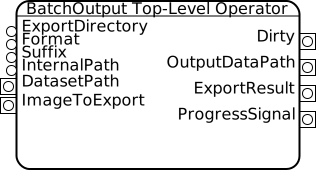
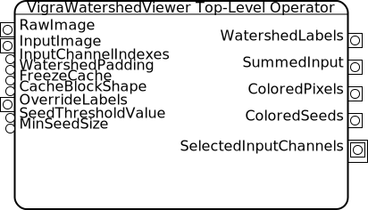

==============
Applet Library
==============

Example Applets
===============

These applets aren't very useful, but they have simple, clean implementations.
Their source files are the right place to look if you're just getting started.

Threshold Masking
-----------------

.. figure:: images/ThresholdMasking-Top-Level-Operator.svg
   :scale: 100  %
   :alt: Threshold Masking Top-Level Operator

.. currentmodule:: ilastik.applets.thresholdMasking.thresholdMaskingApplet
.. autoclass:: ThresholdMaskingApplet
   :members:

Deviation From Mean
-------------------

.. figure:: images/DeviationFromMean-Top-Level-Operator.svg
   :scale: 100  %
   :alt: Deviation-From-Mean Top-Level Operator

.. currentmodule:: ilastik.applets.deviationFromMean.deviationFromMeanApplet
.. autoclass:: DeviationFromMeanApplet
   :members:

Useful Base Classes
===================

Many applets or applet GUIs are based on these classes.

.. _layer-viewer:

Layer Viewer
------------

.. figure:: images/LayerViewer-Top-Level-Operator.svg
   :scale: 100  %
   :alt: LayerViewer Top-Level Operator

.. currentmodule:: ilastik.applets.layerViewer.layerViewerApplet
.. autoclass:: LayerViewerApplet
   :members:

.. currentmodule:: ilastik.applets.layerViewer.opLayerViewer
.. autoclass:: OpLayerViewer
   :members:
   
.. currentmodule:: ilastik.applets.layerViewer.layerViewerGui
.. autoclass:: LayerViewerGui
   :members:
   
   .. automethod:: __init__

Labeling
--------

.. figure:: images/Labeling-Top-Level-Operator.svg
   :scale: 100  %
   :alt: Labeling Top-Level Operator

.. currentmodule:: ilastik.applets.labeling.labelingApplet
.. autoclass:: LabelingApplet
   :members:

.. currentmodule:: ilastik.applets.labeling.opLabeling

.. autoclass:: OpLabelingSingleLane
   :members:

.. autoclass:: OpLabelingTopLevel
   :members:

.. currentmodule:: ilastik.applets.labeling.labelingGui
.. autoclass:: LabelingGui
   :members:
   
   .. automethod:: __init__

Standard Applets
================

These applets are likely to be re-used in many, if not most, worklows.

Project Metadata
----------------

.. currentmodule:: ilastik.applets.projectMetadata.projectMetadataApplet
.. autoclass:: ProjectMetadataApplet
   :members:

Data Selection
--------------

.. figure:: images/DataSelection-Top-level-Operator.svg
   :scale: 100  %
   :alt: DataSelection Top-Level Operator

.. currentmodule:: ilastik.applets.dataSelection.dataSelectionApplet
.. autoclass:: DataSelectionApplet
   :members:

.. currentmodule:: ilastik.applets.dataSelection.opDataSelection
.. autoclass:: OpDataSelection
   :members:

Batch Output
------------

.. currentmodule:: ilastik.applets.batchIo.batchIoApplet
.. autoclass:: BatchIoApplet
   :members:

Workflow-specific Applets
=========================

These applets were designed with particular workflows in mind, but they could be used with future workflows, too.

Feature Selection
-----------------

.. figure:: images/Wrapped-OpFeatureSelection.svg
   :scale: 100  %
   :alt: Feature Selection Top-Level Operator

.. currentmodule:: ilastik.applets.featureSelection.featureSelectionApplet
.. autoclass:: FeatureSelectionApplet
   :members:

Pixel Classification
--------------------

.. figure:: images/opPixelClassification.svg
   :scale: 100  %
   :alt: Pixel Classification Top-Level Operator

.. figure:: images/OpPixelClassification_detailed.png
   :scale: 20 %
   :alt: Pixel Classification Top-Level Operator

.. currentmodule:: ilastik.applets.pixelClassification.pixelClassificationApplet
.. autoclass:: PixelClassificationApplet
   :members:

Watershed Viewer
----------------

.. currentmodule:: ilastik.applets.vigraWatershedViewer.vigraWatershedViewerApplet
.. autoclass:: VigraWatershedViewerApplet
   :members:

