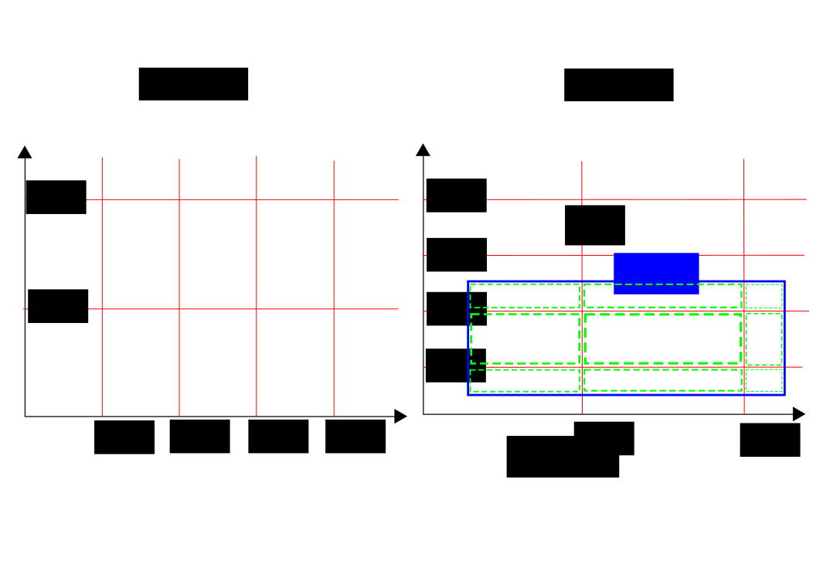
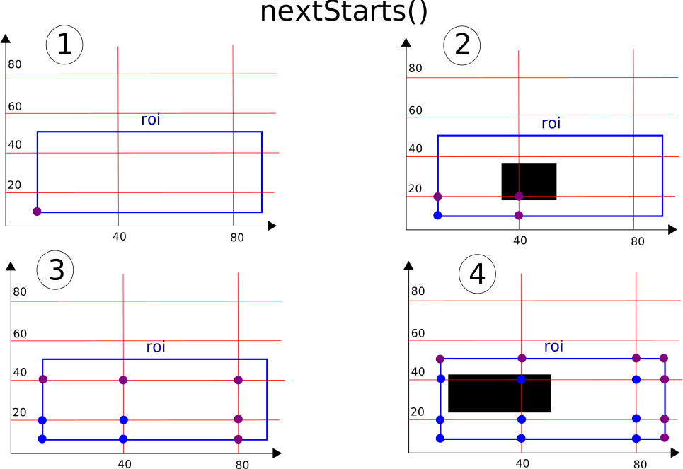
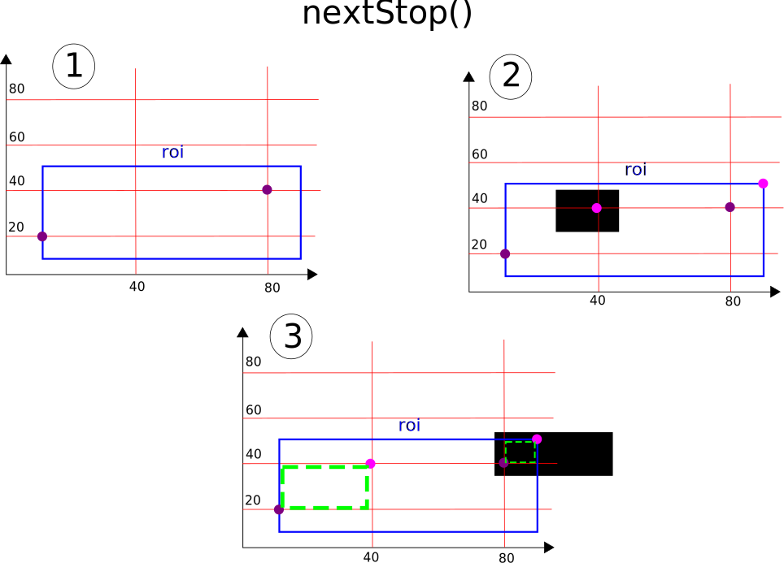
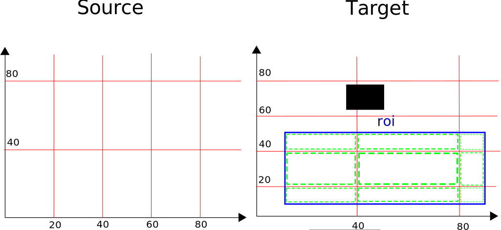

.. _axis-iterator:

==========================
Axis Iterator
==========================

Overview
============

The Axisiterator has been designed to provide a way to iterate through two volumes which is easy on the eye. An example of a typical use ist:

.. code-block:: python

 	it = AxisIterator(roi,srcGrid,trgtGrid)
	for src,trgt,mask in it:
		target[trgt] = operation_on_source(source[src])[mask]

``trgt``, ``src`` and ``mask`` represent slicings which can be applied to anything that implements the ``__getitem__(key)`` method, usually an n-dimensional array.
``trgt`` specifies the slice in the target array, ``src`` specifies the slice in the source array. If the operation should inflate the data from the source slice, ``mask`` cuts it down to the appropriate size. ``mask`` and ``trgt`` slices are always congruent.

.. _inner-mechanics:

Inner Mechanics
===============

Consider the following example:

.. code-block:: python

	roi = Roi((10,10),(90,50))
	srcGrid = (20,40)
	trgtGrid = (40,20)
	it = AxisIterator(roi,srcGrid,trgtGrid)

It could be visualized like this:

.. figure:: images/iterator_exposition.svg
   :scale: 100  %
   :alt: iterator exposition
   

Using this:

.. code-block:: python

	for src,trgt,mask in it:
		print 'src ',src
		print 'trgt ',trgt
		print 'mask ',mask
		print '--------------------------------------------------'

One will get the following output:

.. code-block:: python

	src  (slice(0, 20, None), slice(0, 40, None))
	trgt  (slice(0, 30, None), slice(0, 10, None))
	mask  (slice(0, 30, None), slice(0, 10, None))
	--------------------------------------------------
	src  (slice(20, 40, None), slice(40, 80, None))
	trgt  (slice(30, 70, None), slice(10, 30, None))
	mask  (slice(0, 40, None), slice(0, 20, None))
	--------------------------------------------------
	src  (slice(40, 60, None), slice(80, 120, None))
	trgt  (slice(70, 80, None), slice(30, 40, None))
	mask  (slice(0, 10, None), slice(0, 10, None))
	--------------------------------------------------
	src  (slice(20, 40, None), slice(80, 120, None))
	trgt  (slice(30, 70, None), slice(30, 40, None))
	mask  (slice(0, 40, None), slice(0, 10, None))
	--------------------------------------------------
	src  (slice(40, 60, None), slice(40, 80, None))
	trgt  (slice(70, 80, None), slice(10, 30, None))
	mask  (slice(0, 10, None), slice(0, 20, None))
	--------------------------------------------------
	src  (slice(0, 20, None), slice(40, 80, None))
	trgt  (slice(0, 30, None), slice(10, 30, None))
	mask  (slice(0, 30, None), slice(0, 20, None))
	--------------------------------------------------
	src  (slice(0, 20, None), slice(80, 120, None))
	trgt  (slice(0, 30, None), slice(30, 40, None))
	mask  (slice(0, 30, None), slice(0, 10, None))
	--------------------------------------------------
	src  (slice(20, 40, None), slice(0, 40, None))
	trgt  (slice(30, 70, None), slice(0, 10, None))
	mask  (slice(0, 40, None), slice(0, 10, None))
	--------------------------------------------------
	src  (slice(40, 60, None), slice(0, 40, None))
	trgt  (slice(70, 80, None), slice(0, 10, None))
	mask  (slice(0, 10, None), slice(0, 10, None))
	--------------------------------------------------
	
As you can see, for every ``trgt`` slice there is a correspondig ``src`` and ``mask`` slice. In the first step the ``roi`` gets broken down in a number of ``trgt`` slices:

   
This is achieved by ``getSubRois(self,point,grid,roi)``,which calls ``nextStop(self,start,grid,roi)`` and ``nextStarts(self,point,grid,roi) `` repeatedly. For each point ``nextStarts()`` returns
the next points where either the grid intersects the grid itself or the ``roi``. ``nextStop()`` returns for each starting point the stopping point, meaning the next point where the grid intersects itself or the ``roi`` AND the point where the volume of `` [start,stop]`` is greater than zero. Visualized:

When you have all starting points, ``nextStop()`` can be used to find the next stopping point, IF there is one. Two examples:

   
The last step is of course merely conceptual. Once the ``trgt`` space is segmented into ``trgt`` slices, each ``trgt`` slice is mapped to a ``src`` slice. This is done using the ``mapRoiToSource()`` method. HOW this mapping is done is up to the developer. In the current implementation it fits the needs of image filtering. An illustration:

Now all that has to be done is to create the ``mask`` slice. Why is there a need for this? Sometimes the filter operation inflates the image and returns e.g. 3 channels even if you requested just one. The ``mask`` 
slice cuts out the desired part. Here is an illustration:

.. figure:: images/iterator_mask.svg
   :scale: 100  %
   :alt: mapping a trgt roi to the src roi
   
Finally ``src``, ``trgt`` and ``mask`` slices are grouped together and returned.

.. _real-world-example:

A real world example
====================

To illustrate how the iterator is used we consider this example:

.. code-block:: python

	class OpStructureTensorEigenvaluesSummedChannels(OpBaseVigraFilter):
    		inputSlots = [InputSlot("Input"), InputSlot("Sigma", stype="float"), InputSlot("Sigma2", stype="float")]
    		name = "StructureTensorEigenvalues"
    
    		def __init__(self, *args, **kwargs):
        		super(OpStructureTensorEigenvaluesSummedChannels, self).__init__(*args, **kwargs)
    
    		def getChannelResolution(self):
       			return self.Input.meta.shape[self.Input.meta.axistags.channelIndex]
    
   		def calculateHalo(self, sigma):
       			sigma1 = self.Sigma.value
       		 	sigma2 = self.Sigma2.value
       		 	return int(numpy.ceil(sigma1 * self.windowSize)) + int(numpy.ceil(sigma2 * self.windowSize))
        
 		def setupFilter(self):
   			innerScale = self.Sigma.value
    			outerScale = self.inputs["Sigma2"].value
        
        		def tmpFilter(source, innerScale, outerScale, window_size, roi):
            			tmpfilter = vigra.filters.structureTensorEigenvalues
            			return tmpfilter(image=source, innerScale=innerScale, outerScale=outerScale, window_size=window_size, roi=(roi.start, roi.stop))

        		self.vigraFilter = partial(tmpFilter, innerScale=innerScale, outerScale=outerScale, window_size=self.windowSize)

        		return max(innerScale, outerScale)
    
    		def setupIterator(self, source, result):
        		self.iterator = AxisIterator(source, 'spatial', result, 'spatial', [(), ({'c':self.channelsPerChannel()})])   
        
    		def resultingChannels(self):
        		return self.Input.meta.axistags.axisTypeCount(vigra.AxisType.Space)
    
    		def channelsPerChannel(self):
        		return self.Input.meta.axistags.axisTypeCount(vigra.AxisType.Space)

This operator mimics the natural behavior of the ``vigra.filters.structureTensorEigenvalus`` filter. The operator class is a subclass of ``OpBaseVigraFilter``. While ``OpBaseVigraFilter`` holds the general functionality for filter operations, the subclasses implement the individual filter features. 

This operator filters all input channels and sums them up. Each output channel holds the same information (this is kind of useless, but as already pointed out, it mimics the behavior of the vigra library). The method ``channelsPerChannel()`` tells the ``OpBaseVigraFilter`` how many result channels are generated by the filter per source channel. The ``getChannelResolution()`` method tells the ``OpBaseVigraFilter`` how many source channels are necessary to generate one/or more result channel. In ``setupFilter()`` the filter is setup as a partial function. In ``calculateHalo()`` the halo for the filter is calculated, the method of calculation varies from filter to filter. Lastly the ``resultingChannels()`` method determines the size of the output channel dimensions.

Let us have a look at the ``execute()`` method of ``OpBaseVigraFilter`` to see how the iterator is set up:

.. code-block:: python

    def execute(self, slot, subindex, roi, result):
        #request,set or compute the necessary parameters
        axistags = self.Input.meta.axistags
        inputShape = self.Input.meta.shape
        channelIndex = axistags.index('c')
        channelsPerC = self.channelsPerChannel()
        channelRes = self.getChannelResolution()
        timeIndex = axistags.index('t')
        if timeIndex >= roi.dim:
            timeIndex = None
        roi.setInputShape(inputShape)
        origRoi = roi.copy()
        sigma = self.setupFilter()
        halo = self.calculateHalo(sigma)
        
        #set up the roi to get the necessary source
        roi.expandByShape(halo, channelIndex, timeIndex).adjustChannel(channelsPerC, channelIndex, channelRes)
        source = self.Input(roi.start, roi.stop).wait()
        source = vigra.VigraArray(source, axistags=axistags)
        
        #set up the grid for the iterator, and the iterator
        srcGrid = [source.shape[i] if i != channelIndex else channelRes for i in range(len(source.shape))]
        trgtGrid = [inputShape[i]  if i != channelIndex else self.channelsPerChannel() for i in range(len(source.shape))]
        if timeIndex is not None:
            srcGrid[timeIndex] = 1
            trgtGrid[timeIndex] = 1
        nIt = AxisIterator(origRoi, srcGrid, trgtGrid, timeIndex=timeIndex, channelIndex=channelIndex)
        
        #set up roi to work with vigra filters
        if timeIndex > channelIndex and timeIndex is not None:
            origRoi.popDim(timeIndex)
            origRoi.popDim(channelIndex)
        elif timeIndex < channelIndex and timeIndex is not None:
            origRoi.popDim(channelIndex)
            origRoi.popDim(timeIndex)
        else:
            origRoi.popDim(channelIndex)
        origRoi.adjustRoi(halo)
        
        #iterate over the requested volumes
        pool = Pool()
        for src, trgt, mask in nIt:
            req = Request(partial(result.__setitem__, trgt, self.vigraFilter(source=source[src], window_size=self.windowSize, roi=origRoi)[mask]))
            pool.add(req)
        pool.wait()
        return result

As one can see the ``execute()`` method is fairly general, the individual features of the filter operation is expressed at two points: when the halo gets calculated and when the iterator is setup. Let us have a look at the iterator setup:

.. code-block:: python

	#set up the grid for the iterator, and the iterator
        srcGrid = [source.shape[i] if i != channelIndex else channelRes for i in range(len(source.shape))]
        trgtGrid = [inputShape[i]  if i != channelIndex else self.channelsPerChannel() for i in range(len(source.shape))]
        if timeIndex is not None:
            srcGrid[timeIndex] = 1
            trgtGrid[timeIndex] = 1
        nIt = AxisIterator(origRoi, srcGrid, trgtGrid, timeIndex=timeIndex, channelIndex=channelIndex)

The ``src grid`` is identical to the shape except in the channel dimension, which is equal to the channel resolution. In this example it is equal to the magnitude of the source channel dimension, since all channels are needed for the calculation of the sum. The ``trgt`` grid has the same property, except that the channel dimensions equal the return value of the ``channelsPerChannel()`` method. This is also equal to the source channel dimension, since this is expected of the filter. The spatial and time like dimensions are equal to the shape, so that the volume does not get segmented - only the channel dimension.

Let us take a second example:

.. code-block:: python

	class OpStructureTensorEigenvalues(OpBaseVigraFilter):
   		inputSlots = [InputSlot("Input"), InputSlot("Sigma", stype="float"), InputSlot("Sigma2", stype="float")]
    		name = "StructureTensorEigenvalues"
    
    		def __init__(self, *args, **kwargs):
        		super(OpStructureTensorEigenvalues, self).__init__(*args, **kwargs)
    
    		def calculateHalo(self, sigma):
        		sigma1 = self.Sigma.value
        		sigma2 = self.Sigma2.value
        		return int(numpy.ceil(sigma1 * self.windowSize)) + int(numpy.ceil(sigma2 * self.windowSize))
        
    		def setupFilter(self):
        		innerScale = self.Sigma.value
        		outerScale = self.inputs["Sigma2"].value
        
        		def tmpFilter(source, innerScale, outerScale, window_size, roi):
            			tmpfilter = vigra.filters.structureTensorEigenvalues
            			return tmpfilter(image=source, innerScale=innerScale, outerScale=outerScale, window_size=window_size, roi=(roi.start, roi.stop))

        		self.vigraFilter = partial(tmpFilter, innerScale=innerScale, outerScale=outerScale, window_size=self.windowSize)

        		return max(innerScale, outerScale)
    
        
    		def resultingChannels(self):
        		return self.Input.meta.axistags.axisTypeCount(vigra.AxisType.Space) * self.Input.meta.shape[self.Input.meta.axistags.channelIndex]
    
    		def channelsPerChannel(self):
        		return self.Input.meta.axistags.axisTypeCount(vigra.AxisType.Space)

This filter produces one result for each spatial axis and for each source channel. Consequently ``channelPerChannel()`` returns ``self.Input.meta.axistags.axisTypeCount(vigra.AxisType.Space)``. ``getChannelResolution()`` returns its default, 1, since each source channel gets evaluated separately. 
