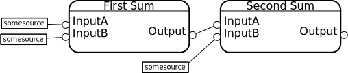
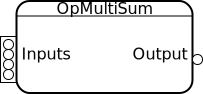
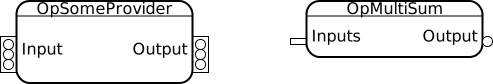
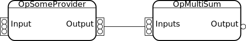
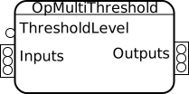

=================
Advanced Concepts
=================

In this section, we'll discuss some of lazyflow's advanced features, including multi-slots, composite operators, and the ``OperatorWrapper`` class.

Simple Binary Operator
======================

To motivate this discussion, let start by considering this simple example operator::

    class OpSum(Operator):
        InputA = InputSlot()
        InputB = InputSlot()
        
        Output = OutputSlot()
    
        def setupOutputs(self):
            assert self.InputA.meta.shape == self.InputB.meta.shape, "Can't add images of different shapes!"
            self.Output.meta.assignFrom(self.InputA.meta)
    
        def execute(self, slot, subindex, roi, result):
            a = self.InputA.get(roi).wait()
            b = self.InputB.get(roi).wait()
            result[...] = a+b
            return result

        def propagateDirty(self, dirtySlot, subindex, roi):
            self.Output.setDirty(roi)

The operator above can be represented graphically with the following diagram:

.. figure:: images/opSum.svg
   :scale: 100  %
   :alt: Simple addition operator

What if you want to add three images?  You could connect two OpSum operators together, like so::

    op1 = OpSum(...)
    op1.name = "First Sum"
    op2 = OpSum(...)
    op2.name = "Second Sum"
    
    op1.InputA.connect(someSourceA)
    op1.InputB.connect(someSourceB)
    
    op2.InputA.connect(op1.Output)
    op2.InputB.connect(someSourceC)
    
    imageSum = op2.Output[:].wait()

Higher-level Slots
======================

But chaining operators in this way isn't always the right thing to do.  A more flexible option is to use lazyflow's higher-level slots.  Lazyflow slots are constructed with a particular "level".
By default, Slots have level 0.  A slot of level 1 acts like a *list* of normal (level-0) slots.  A slot of level 2 acts like a list of level-1 slots, and so on.
Graphically, we use circles for level-0 slots, and rectangles to represent slots of other levels.

.. note:: In older versions of lazyflow, slots with level > 0 were known as "MultiSlots".  You'll see that term throughout the code base, and we'll use that term in this documentation, too.  Just remember it means "a slot of level >= 1".

Let's rewrite the OpSum to use a single "multislot" as its input::

    class OpMultiSum(Operator):
        Inputs = InputSlot(level=1)
        Output = OutputSlot()
    
        def setupOutputs(self):
            expectedShape = self.Inputs[0].meta.shape
            for slot in self.Inputs:
                assert slot.meta.shape == expectedShape, "Can't add images of different shapes!"
            self.Output.meta.assignFrom(self.Inputs[0].meta)
    
        def execute(self, slot, subindex, roi, result):
            result[...] = numpy.zeros(result.shape)
            for slot in self.Inputs:
                result[...] += slot.get(roi).wait()
            return result

        def propagateDirty(self, dirtySlot, subindex, roi):
            self.Output.setDirty(roi)

Graphically, the OpMultiSum operator looks like this:

.. figure:: images/opMultiSumEmpty.svg
   :scale: 100  %
   :alt: Addition of N images

Notice that our input slot has no capacity yet.  We can change that by resizing it with the number of slots we intend to connect::

    opMultiSum = OpMultiSum(...)
    opMultiSum.Inputs.resize(4)

Alternatively, the input slot will be automatically resized to match its upstream partner as soon as you connect it.

Before connection:

After connection:

When two multi-slots are connected, their subslots are internally connected to eachother.  For clarity, those connections aren't typicaly shown in graphical diagrams.  
When you see two connected multi-slots, you can imagine their subslot connections looking like this:

.. figure:: images/multi_connect_detail.svg
   :scale: 100  %
   :alt: Subslot connections in a multi-slot connection

Composite Operators
===================
Consider the following simple thresholding operator, which produces a binary image from an input image and a threshold value::

    class OpThreshold(Operator):
        ThresholdLevel = InputSlot()
        Input = InputSlot()
        Output = OutputSlot()
        
        def setupOutputs(self):
            self.Output.meta.assignFrom(self.Input.meta)
            self.Output.meta.dtype = numpy.uint8

        def execute(self, slot, subindex, roi, result):
            thresholdLevel = self.ThresholdLevel.value
            inputData = self.Input.get(roi).wait()
            result[...] = inputData > thresholdLevel
            return result

        def propagateDirty(self, dirtySlot, subindex, roi):
            self.Output.setDirty(roi)

That works for a single image, but what if we have multiple images to threshold?  We need to implement an operator with this interface:

A naive approach is to re-implement the original (single-image) operator from scratch::

    class OpMultiThreshold(Operator):
        ThresholdLevel = InputSlot()
        Inputs = InputSlot(level=1)
        Outputs = OutputSlot(level=1)
        
        def setupOutputs(self):
            self.Outputs.resize( len(self.Inputs) )
            for i in range( len(self.Inputs) ):
                self.Outputs[i].meta.assignFrom(self.Inputs[i].meta) 
                self.Outputs[i].meta.dtype = numpy.uint8

        def execute(self, slot, subindex, roi, result):
            assert len(subindex) == 1
            index = subindex[0]
            thresholdLevel = self.ThresholdLevel.value
            inputData = self.Inputs[index].get(roi).wait()
            result[...] = inputData > thresholdLevel
            return result

        def propagateDirty(self, dirtySlot, subindex, roi):
            self.Outputs[subindex].setDirty(roi)

That doesn't look too bad, but it duplicates most of the functionality of the original operator, which leads to big maintenance issues for more complicated operators.

A better approach is to write a composite operator that keeps a list of single-image operators internally.  Here's an example::

    class OpMultiThreshold(Operator):
        ThresholdLevel = InputSlot()
        Inputs = InputSlot(level=1)
        Outputs = OutputSlot(level=1)
        
        def __init__(self, *args, **kwargs):
            # Initialize base class
            super(OpMultiThreshold, self).__init__(*args, **kwargs)
            # Initialize our list of internal operators
            self.internalOps = []
        
        def setupOutputs(self):
            # Clean up any previously created internal operators
            for slot in self.Outputs:
                slot.disconnect()
            for op in self.internalOps:
                op.cleanUp()

            self.internalOps = []
            self.Outputs.resize( len(self.Inputs) )

            # Create an internal thresholding operator for each input image
            for i in range( len(self.Inputs) ):
                singleImageOp = OpThreshold( parent=self )
                singleImageOp.ThresholdLevel.connect( self.ThresholdLevel )
                singleImageOp.Input.connect( self.Inputs[i] )
                self.Outputs[i].connect( singleImageOp.Output )
                
                self.internalOps.append( singleImageOp )

        def execute(self, slot, subindex, roi, result):
            pass # Nothing to do here: our output will forward all requests to the internal operators

        def propagateDirty(self, slot, subindex, roi):
            pass # Nothing to do here: our internal operators handle dirty propagation on their own

Okay, at least we're not duplicating the execute function, which is the meat of the operator's implementation.  But it's still a lot of code!  Read the next section for an easier implementation.

By the way, here's what this composite operator's diagram looks like:

.. figure:: images/opMultiThreshold_composite.svg
   :scale: 100  %
   :alt: Threshold Operator for Multiple Images implemented as a composite operator

Notice that the ``ThresholdLevel`` slot is shared among all the internal thresholding operators.

The OperatorWrapper class
=========================
It turns out that creating multi-image operators composed of single-image operators (as shown in the last section) is a common design pattern when crafting a non-trivial lazyflow workflow.
Did you notice that none of the code in the OpMultiThreshold example above had much to do with thresholding?  
Lazyflow offers a handy generic utility for creating such operators known as the ``OperatorWrapper``.  To use it, just provide it with the class (type) you want to use as the internal operator::

    opMultiThreshold = OperatorWrapper( OpThreshold, graph=my_graph )

With no inputs, your diagram looks mostly empty.  Notice that the new operator has the same inputs and outputs as the single-image version, but each slot is one-level higher (they are lists).

.. figure:: images/wrapped_opThreshold_empty.svg
   :scale: 100  %
   :alt: Threshold Operator for Multiple Images implemented as a composite operator

When we add some inputs, we can see that our OperatorWrapper instance creates internal operators as necessary::

    opMultiThreshold.Input.resize(2)

.. figure:: images/wrapped_opThreshold_with_inputs.svg
   :scale: 100  %
   :alt: Threshold Operator for Multiple Images implemented as a composite operator (shown with 2 inputs)

This is *almost* what we wanted.  Notice that the operator's ``ThresholdLevel`` slot has level=1.  Furthermore, each internal operator's ``ThresholdLevel`` slot is 
connected to a separate ``ThresholdLevel`` subslot.  This means that it would be possible to 
threshold each of our input images with a *different* threshold value, which is not desirable for our use case.

We can fix this by explicitly specifying which inputs should be shared among all internal operators, and which ones should remain separate.  Those that are shared will *not* be increased in level.
We specify this by passing a list of slot names to 'promote' (i.e. listify) in the OperatorWrapper constructor.  All others will be shared::

    opMultiThreshold = OperatorWrapper( OpThreshold, graph=my_graph, promotedSlotNames=['Input'] )
    opMultiThreshold.Input.resize(2)

.. figure:: images/wrapped_opThreshold_with_shared_threshold.svg
   :scale: 100  %
   :alt: Wrapped OpThreshold with shared ThresholdLevel

Now only the ``Input`` slot has been 'promoted' to a list input.  The other slot, ``ThresholdLevel`` remains a level-0 slot, which is shared with all internal operators.

