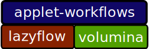

Overview
========

The ilastik 0.6 code base consists of three separate projects, each of which has its own repository:

* lazyflow - multithreaded computations implemented via data flow graphs
* volumina - 5D image viewer GUI
* ilastik - ilastik-shell and the applet API and base classes

This is the documentation for the ilastik repo, which provides a framework for creating GUI applications that leverage 
lazyflow-based computation pipelines and the volumina 5D image viewing kit.
The goal of the ilastik framework is to facilitate rapid development of user interfaces for image processing pipelines.  
The GUI for an entire computational pipeline is built in pieces, known as "applets".  
The applets for a particular pipeline are chained together to form a "workflow".

The ilastik framework defines a simple GUI "shell" that serves as a container for the applets guis, 
which combine a piece of a lazyflow pipeline with the GUI elements to configure it.  
