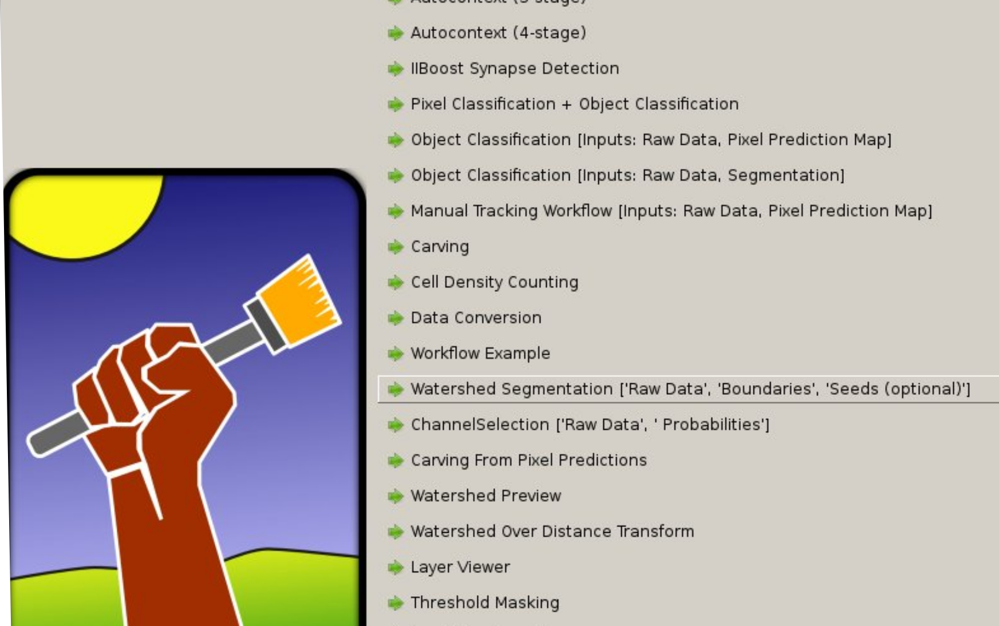

================================================================================
Building your own workflow using the watershedSegmentation workflow
================================================================================
Define the variables, python and so on for this particular terminal, 
so that ilastik has everything it wants to have:

.. code::

        $ source activate ilastik-devel

Show workflow in ilastik
========================================

Open the file

.. code::

        $ ilastik/workflows/__init__.py

add the following lines (adjusted to your project) at the disired position, 
between which other workflows it should lie:

.. code::

        try:
            import watershedSegmentation
            WORKFLOW_CLASSES += [watershedSegmentation.watershedSegmentationWorkflow.WatershedSegmentationWorkflow]
        except ImportError as e:
            logger.warn("Failed to import 'watershedSegmentation' workflow; check dependencies: " + str(e))

Afterwards you can see your workflow in the following list:

   List of possible workflows in ilastik, if you want to open a new project.

Basic File Structure
========================================

Then create a folder in 
ilastik/workflows/
with the name watershedSegmentation:
In this directory there are 2 files:

#. __init__.py

.. literalinclude:: ../ilastik/workflows/watershedSegmentation/__init__.py
   :linenos:
   :language: python

#. watershedSegmentationWorkflow.py

   * Includes all the applets for this workflow and how they are connected with each other

   * Includes all the exposing to the shell and the update handling for applets

   

Basic Structure in watershedSegmentationWorkflow.py
================================================================================

Our Workflow should inherit from:

.. currentmodule:: ilastik.workflow
.. class:: Workflow

In the init, you create all necessary applets for later use.

The function 

.. code::

    def connectLane(self, laneIndex):

connects applets with each other. 
Therefore one OutputSlot of the frist applet can be connected via 'pyQt: connect'
to the InputSlot of the second applet. That means, the second applet gets the output of the first applet. 

Normally this looks like this (click on the source link for viewing the code):

.. currentmodule:: ilastik.workflows.watershedSegmentation.watershedSegmentationWorkflow
.. autoclass:: WatershedSegmentationWorkflow
        :members: connectLane

The residual of the class isn't that important for the basic understanding and make your workflow just work. 
Of course it handles all the headless and batch modes and more. 

For further information, you can read the comments in the watershedSegmentationWorkflow and look at other workflows to get a better understanding.
